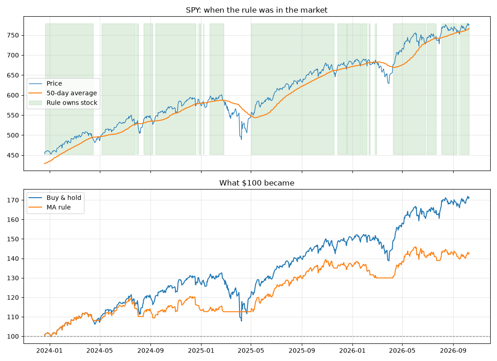
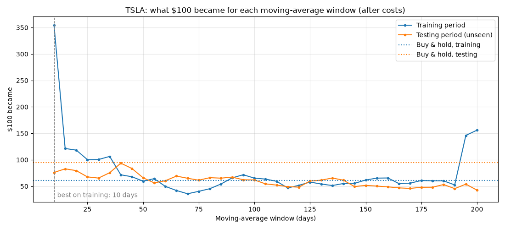
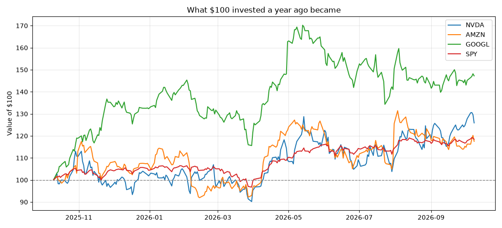
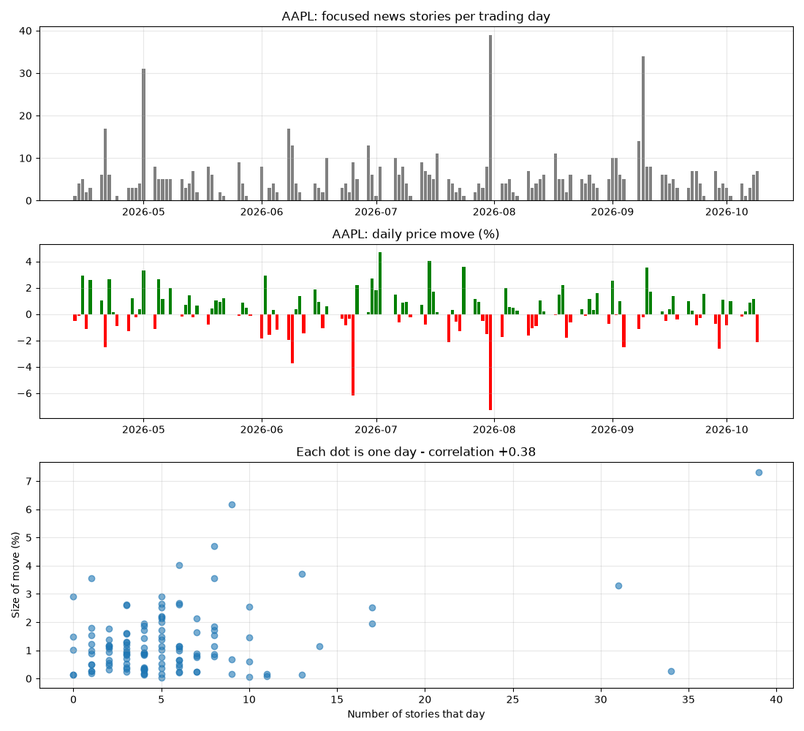
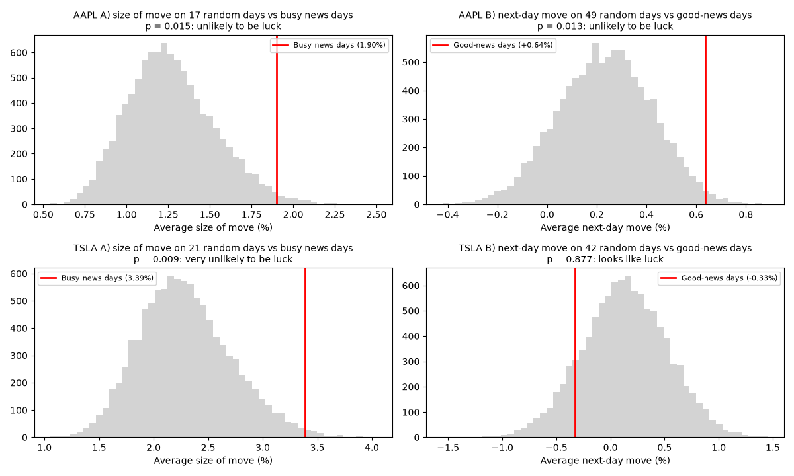
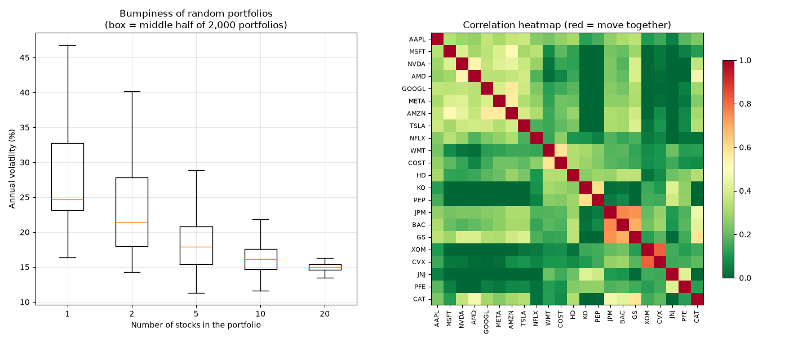
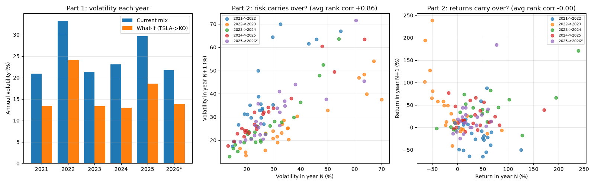
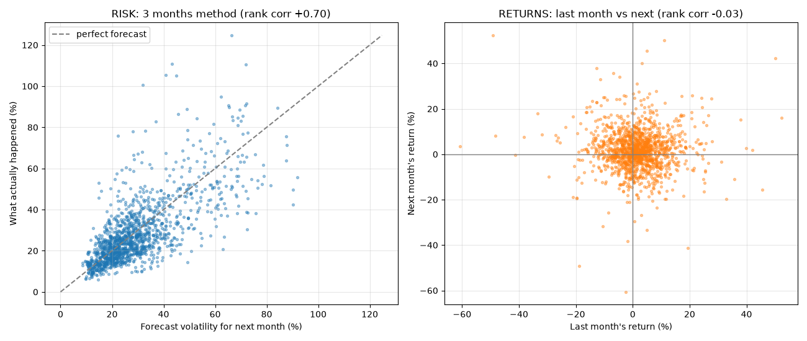

# Stock Market Data Lab

[](https://github.com/Bhargavsinh-Solanki/stock-market-data-lab/actions/workflows/tests.yml)


A hands-on learning project that uses the **[Alpaca](https://alpaca.markets) API** to fetch
live and historical stock market data, test trading rules honestly, run a paper-trading bot,
and show it all on a live web dashboard.

It's built as **28 small, heavily commented lessons**, each one adding a new coding idea.

> ⚠️ Educational project only. Paper trading (fake money). Not financial advice.

---

## What it does

| Area | Highlights |
|---|---|
| **Market data** | Historical daily and 1-minute bars, latest trades, news headlines, live websocket stream |
| **Web crawling** | Own polite crawler: Alpaca + Yahoo Finance RSS into a growing news archive, robots.txt-aware article text extraction |
| **Analysis** | Returns, volatility, max drawdown, moving averages, news volume and headline sentiment (word list and FinBERT AI) vs price moves |
| **Backtesting & statistics** | Moving-average strategy vs buy & hold, trading costs, train/test split, shuffle (permutation) tests across 12 stocks |
| **Paper trading** | Market and limit orders, dry-run-first bots (lesson 8, and lesson 27 with a cash check and email summaries) with watchlists and decision logs, a read-only portfolio health check (money vs risk share, effective number of stocks, overlap) |
| **Dashboard** | Streamlit app with tabs: live-updating intraday chart, account value, positions, bot log, a portfolio health page, and a what-if simulator with sliders |
| **Daily email** | Facts-only market report: your rule alerts, your holdings' moves, market and sector overview, headlines |
| **Engineering** | Shared `helpers` module, unit tests with pytest, CI on GitHub Actions |

## Key findings

These are real results from this project's own data (Oct 2023 – Oct 2026):

1. **A simple trend-following rule didn't beat buy & hold.** On 5 stocks over 3 years, it lost to
   simply holding every time, although it did reduce the worst drops (SPY: −9% vs −19%).
2. **Optimising settings creates false confidence.** The best Tesla setting on training data
   turned $100 into $383. On unseen data, the same setting turned $100 into $85.
   **0 of 39** settings beat buy & hold out-of-sample.
3. **Busy news days really are bigger move days.** On the busiest 20% of news days, AAPL and TSLA moved
   about 1.5× as much as on a typical day. A shuffle test confirmed this for **8 of 12 stocks** (p < 0.05), so it's
   a repeatable effect, though it doesn't show whether news causes moves or moves cause news.
4. **"Good news today → price up tomorrow" is luck.** Apple looked convincing (+0.64% next day,
   p = 0.013), but across 12 stocks only **1 of 12** passed, about what pure chance produces
   (12 × 5% ≈ 0.6). A classic case of the multiple-testing trap.
5. **A real AI model didn't change that.** FinBERT, run locally, read headlines far better than the
   word list (it wasn't fooled by "…Earnings Beat" in a negative story), yet its "good news" days
   predicted the next day for **0 of 12** stocks. Better reading ≠ a trading edge.
6. **Diversification is the closest thing to a free lunch.** Across 2,000 random portfolios each, going
   from 1 to 20 stocks cut volatility by ~40% and lifted the *worst* 3-year result from −14% to +99%.
   5 tech stocks were twice as bumpy as 5 stocks from 5 different sectors (24% vs 12% volatility).
7. **Risk is predictable; returns aren't.** Ranking 22 stocks by volatility, last year's order matched
   this year's with an average rank correlation of **+0.86**. Ranking them by return: **0.00**, swinging
   from −0.86 to +0.61. A calmer what-if mix was calmer in **6 of 6** years, but made more in only 2.
8. **So I forecast risk, not returns.** In 1,400 walk-forward checks on 25 stocks and funds, a simple
   3-month volatility forecast ranked next month's bumpiness with a rank correlation of **+0.70**
   (average miss 8 points). Last month's return predicted next month's return at **−0.03**.

<table>
<tr>
<td></td>
<td></td>
</tr>
<tr>
<td></td>
<td></td>
</tr>
<tr>
<td colspan="2"></td>
</tr>
<tr>
<td colspan="2"></td>
</tr>
<tr>
<td colspan="2"></td>
</tr>
<tr>
<td colspan="2"></td>
</tr>
</table>

## Things I was careful about

- **Split-adjusted prices.** Alpaca returns raw prices by default, which turns stock splits into
  fake 90% crashes (NVDA, June 2024). All requests use `Adjustment.ALL`. Found while building lesson 19.
- **No look-ahead bias.** Signals act the *next* day (`shift(1)`), and news published after the
  16:00 New York close is matched to the next trading day. Both are covered by unit tests.
- **Trading costs** are included in backtests (0.1% per switch).
- **Out-of-sample testing.** Strategy settings are chosen on old data and judged on newer data.
- **Luck checks.** Patterns are shuffle-tested against 10,000 random picks, then re-checked on 12 stocks.
- **Polite crawling.** The crawler obeys robots.txt, waits between visits, identifies itself, never
  re-downloads a page, and skips sites whose terms forbid scraping.
- **Safety.** All trading code is locked to the paper account. The bot dry-runs by default and only
  touches symbols on its watchlist. API keys stay in `.env`, which is never committed.

---

## Getting started

You need Python 3.12+ and a free [Alpaca](https://alpaca.markets) account (paper trading keys).

```bash
git clone https://github.com/Bhargavsinh-Solanki/stock-market-data-lab.git
cd stock-market-data-lab
python3 -m venv .venv
source .venv/bin/activate
pip install -r requirements.txt
cp .env.example .env        # then paste your Alpaca paper keys into .env
```

Check everything works:

```bash
python step1_connect.py     # should print "Connected to Alpaca!"
pytest                      # runs the unit tests (no keys needed)
```

Open the dashboard:

```bash
streamlit run step11_dashboard.py
```
It opens at http://localhost:8501. Press Ctrl+C in the terminal to stop it.

### Daily routine (run by hand after the US market closes)
```bash
python step8_bot.py           # dry run: shows what the bot would do
python step8_bot.py --trade   # sends the paper orders
python step9_report.py        # report card for the paper account
```

### Run the crawler automatically (optional)
macOS has a built-in scheduler called **cron**. To grow the news archive every 2 hours on weekdays,
run `crontab -e`, paste this one line (change the folder path if yours differs), save and close:
```
0 */2 * * 1-5 cd ~/Github/global-political-trades-forecast && .venv/bin/python step17_news_crawler.py >> data/crawler.log 2>&1
```
Check it's there with `crontab -l`. Remove it again with `crontab -e` (delete the line).
Cron skips runs while the Mac is asleep or off, which is fine: the next run catches up on new headlines.

### Daily email report (optional)
1. Turn on 2-Step Verification for your Google account, then create an **App Password**
   (Google Account → Security → App passwords). Add `EMAIL_TO`, `SMTP_USER` and
   `SMTP_PASSWORD` to `.env` (see `.env.example`).
2. Check the settings, preview, then send one to yourself:
   ```bash
   python emailer.py --test
   python step26_daily_email.py
   python step26_daily_email.py --send
   ```
   A failed email never crashes the bot; resend a saved one with
   `python emailer.py --resend data/paper_bot_email.html`.
3. To get it every weekday at 22:30 (after the US close), add a second cron line:
   ```
   30 22 * * 1-5 cd ~/Github/global-political-trades-forecast && .venv/bin/python step26_daily_email.py --send >> data/email.log 2>&1
   ```

### Paper bot with email (optional)
```bash
python step27_paper_bot.py                  # dry run: decisions + email preview, sends nothing
python step27_paper_bot.py --trade --email  # sends PAPER orders and emails you the summary
```
To run it every weekday at 16:00 (30 minutes after the US open, Central European time):
```
0 16 * * 1-5 cd ~/Github/global-political-trades-forecast && .venv/bin/python step27_paper_bot.py --trade --email >> data/paper_bot.log 2>&1
```

## Project structure

```
├── helpers.py                # shared tools: Alpaca clients, data download, backtest maths
├── crawler.py                # polite news crawler: RSS, archive, robots.txt, article text
├── ai_sentiment.py           # FinBERT sentiment, run locally, with a score cache
├── portfolio.py              # portfolio health check + what-if simulator calculations
├── report.py                 # daily report: market moves, your rule checks, headlines, HTML
├── emailer.py                # sends email over SMTP using settings from .env
├── paper_bot.py              # the paper bot's decision table (buy / hold / sell / stay out)
├── risk_forecast.py          # volatility forecasts (windows + EWMA) and walk-forward evaluation
├── step1_connect.py … step28_risk_forecast.py   # the lessons (see below)
├── step11_dashboard.py       # Streamlit dashboard (live: lesson 14, health tab: 21, what-if tab: 22)
├── tests/                    # unit tests on fake data (no internet or keys needed)
├── .github/workflows/        # CI: runs the tests on every push
├── docs/images/              # charts used in this README
├── data/                     # generated CSVs, charts, logs (not committed)
├── requirements.txt
├── .env.example              # template for your API keys
└── my_portfolio.example.csv  # template for your real holdings (your my_portfolio.csv stays private)
```

## Lessons

| # | File | What you learn |
|---|------|----------------|
| 1 | `step1_connect.py` | Logging in to Alpaca with API keys |
| 2 | `step2_prices.py` | Fetching the latest price and 30 days of daily prices |
| 3 | `step3_save_and_chart.py` | Saving a year of prices to CSV, moving average, drawing a chart |
| 4 | `step4_compare.py` | Lists, functions and loops; comparing returns and risk across stocks |
| 5 | `step5_backtest.py` | Backtesting a moving-average rule vs buy & hold; avoiding look-ahead bias |
| 6 | `step6_overfitting.py` | Trading costs, testing many settings, train/test split and overfitting |
| 7 | `step7_paper_order.py` | Placing paper orders (market vs limit), checking positions and orders |
| 8 | `step8_bot.py` | A dry-run-first trading bot: dictionaries, try/except, log files |
| 9 | `step9_report.py` | Daily report card: account value over time, positions, latest bot decisions |
| 10 | `step10_using_helpers.py` | Your own module (`helpers.py`) and automated tests (`tests/`) |
| 11 | `step11_dashboard.py` | A read-only web dashboard with Streamlit: widgets, caching, charts |
| 12 | `step12_news.py` | News headlines vs price moves: joining tables, grouping, correlation, news timing |
| 13 | `step13_live.py` | Live streaming trades and 1-minute bars over a websocket: callbacks, async, timers |
| 14 | `step11_dashboard.py` + repo | Live dashboard section (fragments, polling vs streaming); CI, licence, portfolio README |
| 15 | `step15_sentiment.py` | Scoring headlines as good/bad news: sets, regex, `.apply()`, same-day vs next-day tests |
| 16 | `step16_luck_test.py` | Real or luck? Shuffle tests, p-values, multiple testing: numpy, random seeds, simulation |
| 17 | `step17_news_crawler.py` | Your own polite web crawler and a growing news archive: classes, XML/RSS, HTTP, de-duplication |
| 18 | `step18_ai_sentiment.py` | A free AI (FinBERT) reads the news on your Mac: pre-trained models, probabilities, mocks, caching |
| 19 | `step19_diversification.py` | Diversification: random portfolios, annualised volatility, correlation heatmap, split-adjusted prices |
| 20 | `step20_portfolio_check.py` | Health check of your own paper portfolio: weights, covariance, risk shares, effective number of stocks |
| 21 | `portfolio.py` + dashboard | Health check as a dashboard tab: separating calculations from display, dataclasses, tabs |
| 22 | `portfolio.py` + dashboard | What-if simulator: sliders, session state, normalising weights, hindsight vs forecast |
| 23 | `step23_year_by_year.py` | Year-by-year checks: grouping by year, rank (Spearman) correlation, does risk or return carry over? |
| 24 | `step24_my_portfolio.py` | Health check of a real portfolio from a private CSV: keeping data out of git, monkeypatching, generalising code |
| 25 | `step25_etf_transition.py` | Planner for a gradual move from stocks to ETFs: monthly orders, fee comparison, risk along the path |
| 26 | `step26_daily_email.py` | Daily email report: HTML, SMTP and App Passwords, escaping, fake servers in tests, safe-by-default |
| 27 | `step27_paper_bot.py` | Paper-trading bot that emails its decisions: pure decision functions, cash check, combining modules |
| 28 | `step28_risk_forecast.py` | Forecasting next month's volatility: walk-forward testing, EWMA, risk vs return forecasts |

## Built with

[alpaca-py](https://github.com/alpacahq/alpaca-py) ·
[pandas](https://pandas.pydata.org) ·
[matplotlib](https://matplotlib.org) ·
[Streamlit](https://streamlit.io) ·
[Altair](https://altair-viz.github.io) ·
[pytest](https://pytest.org) ·
GitHub Actions

---

## Glossary

**Data & APIs**
- **API**: a "menu" a company offers so programs can ask it for data.
- **API key**: your username and password for that menu. Keep it secret.
- **Bar / candle**: one time period summarised as Open, High, Low, Close, Volume.
- **CSV**: a plain-text spreadsheet; opens in Excel, Numbers or Google Sheets.
- **Request vs stream**: a request asks once and gets one answer (a letter); a stream stays open and data keeps arriving (a phone call).
- **Websocket**: the technology behind a stream - a connection that stays open both ways.
- **Polling**: asking "anything new?" again and again on a timer.
- **Unix timestamp**: a date stored as seconds since 1 January 1970.
- **SSL certificate**: a digital ID card that proves a website is who it says it is.
- **RSS feed**: a list of a site's newest stories, written in XML, meant to be read by programs.
- **Crawler (scraper)**: a program that visits web pages and saves information from them.
- **robots.txt**: a website's rules for robots: which pages crawlers may and may not visit.
- **User-Agent**: the name badge a program shows a website when it visits.
- **HTTP status code**: a website's reply code: 200 = OK, 403 = forbidden, 404 = not found.

**Investing & trading**
- **Paper trading**: a practice account with fake money.
- **Return**: how much an investment grew or shrank, in %.
- **Volatility (typical daily move)**: how much a price usually jumps per day. Bigger = bumpier ride.
- **Biggest drop (max drawdown)**: the worst fall from a high point to a later low.
- **Benchmark (SPY)**: a fund tracking the 500 biggest US companies; the "average market" to compare against.
- **Moving average**: the average price over the last N days; smooths out noise to show the trend.
- **Compounding**: gains building on earlier gains, day after day.
- **Spread / slippage**: hidden trading costs - the gap between buy and sell prices, and price moving while your order fills.
- **Market order**: buy/sell now at the current price. Fast, but you don't pick the price.
- **Limit order**: buy/sell only at your price or better. You pick the price, but it may never fill.
- **Position**: a stock you currently own. **Filled**: the order actually happened.
- **Unrealized profit/loss**: how much a position is up or down on paper, before you sell.
- **Hindsight**: judging with knowledge of what actually happened; a what-if on past prices isn't a forecast.
- **ADR**: a US-traded certificate for a foreign company's shares (e.g. Bayer → BAYRY).
- **IPO / listing**: when a company's shares start trading on a stock exchange; there's no price history before it.
- **Currency (FX) risk**: if you invest in euros in US-dollar assets, the EUR/USD rate moves your result too.
- **Hedge**: a holding that tends to move against the rest, so it can *reduce* total risk (a negative risk share).
- **UCITS**: the EU standard for funds; EU investors usually buy UCITS ETFs rather than US-listed ones.
- **Order fee**: what a platform charges per buy or sell; many small orders can add up to a big share of a small portfolio.
- **Persistence**: whether something stays similar from one period to the next (volatility does; returns don't).
- **Walk-forward test**: forecast, wait, check, repeat - only ever using data from before each forecast.
- **EWMA**: an average where recent days count more and older days fade away ("RiskMetrics", λ = 0.94).
- **Risk forecast**: a guess of how much prices may swing - not which way.
- **Year to date (YTD)**: from 1 January until today - an unfinished year.
- **Stock split**: a company turns each share into several cheaper ones (e.g. 1 → 10). Raw prices drop, but nobody loses money.
- **Adjusted prices**: old prices rewritten to account for splits and dividends, so charts and returns stay honest.
- **Diversification**: spreading money over many investments so one bad one can't sink you.
- **Equal weight**: the same amount of money in each stock.
- **Sector**: a group of companies in the same industry (tech, energy, banks…), which tend to move together.
- **Rotation**: money moving out of one group of stocks and into another, so they move in opposite directions.
- **Weight**: a position's share of the portfolio's money (all weights add up to 100%).
- **Risk share (risk contribution)**: how much of the portfolio's total bumpiness comes from one position.
- **Effective number of stocks**: how many equal-sized positions a portfolio really behaves like (1 ÷ sum of squared weights).
- **ETF / fund**: one share that holds many companies at once (SPY ≈ 500, QQQ ≈ 100).

**Testing strategies**
- **Backtest**: replaying a trading rule on old prices to see how it would have done.
- **Signal**: the rule's decision for each day (own the stock or hold cash).
- **Look-ahead bias**: accidentally using information you couldn't have had at the time. Makes results look too good.
- **Overfitting**: tuning a rule until it fits the past perfectly, including the luck, so it fails on new data.
- **Train / test split**: choose settings on old data, then judge them on newer data they've never seen.
- **Correlation**: a number from -1 to +1 showing how strongly two things move together.
- **Correlation is not causation**: two things moving together doesn't prove one causes the other.
- **Rank (Spearman) correlation**: correlation of the ORDER of things (1st, 2nd, 3rd...), ignoring exact sizes.
- **Sentiment**: whether a piece of text sounds positive or negative.
- **Noise**: random ups and downs that can look like a pattern, especially in small samples.
- **Shuffle test (permutation test)**: compare your result with thousands of random picks to see if luck could explain it.
- **p-value**: the share of random picks that did at least as well as yours. Under 0.05 = "unlikely to be luck".
- **Multiple testing**: try enough ideas and some will pass by chance (about 1 in 20 at p < 0.05).

**Coding**
- **Module**: a file of reusable tools that other files can `import`.
- **Test / assert**: a small program that checks other code gives a known right answer; `assert` means "this must be true".
- **CI (continuous integration)**: GitHub automatically runs the tests on every push.
- **Join / group by**: matching two tables on a shared column / sorting rows into buckets and counting them.
- **Callback**: a function you write but someone else (here, Alpaca's library) calls when something happens.
- **async / await**: Python's way to wait for many things at once without freezing.
- **Caching**: remembering a result for a while so you don't fetch it again on every click.
- **Fragment**: a part of a Streamlit page that can refresh on its own.
- **Set**: a collection of unique items with very fast "is this in it?" checks.
- **NumPy**: a library for fast maths on whole lists of numbers at once.
- **Random seed**: a starting number that makes "random" results repeatable.
- **Histogram**: a bar chart of how often each value came up.
- **Annualise**: turn a daily number into a yearly one (volatility: daily × √252 trading days).
- **Heatmap**: a grid of coloured squares, where colour shows the size of each number.
- **Covariance**: like correlation, but also counts how big the moves are.
- **Matrix multiplication (`@`)**: combining every pair of rows and columns in one step.
- **Separation of concerns**: keeping calculations apart from display, so several screens can share one set of maths.
- **Dataclass**: a simple labelled container holding several results together.
- **Refactoring**: reorganising code without changing what it does.
- **Session state**: memory that survives when a Streamlit page re-runs (e.g. slider positions).
- **Normalise**: scale numbers so they add up to a total, e.g. slider values → shares adding up to 100%.
- **Floating-point error**: tiny leftovers in computer maths (0.1 + 0.2 = 0.30000000000000004).
- **Recursion**: a function that calls itself; without a stopping point it runs until Python gives up.
- **Monkeypatching**: temporarily swapping a function for a fake one in a test (e.g. no real download).
- **Twin axis**: a chart with two y-axes, so two different units (e.g. € and %) can share one picture.
- **HTML**: the language of web pages, also used for formatted emails.
- **SMTP**: the standard way programs send email.
- **App Password**: a separate password just for one program, so your main password is never stored.
- **Escaping**: making text safe to show inside HTML, so `<` and `&` can't break or hijack the page.
- **Safe by default**: a program that only previews unless you explicitly tell it to act (`--send`, `--trade`).
- **Pure function**: gives the same output for the same input and touches nothing outside itself - easy to test.
- **Class**: a bundle of data and the functions that work on it (e.g. `PoliteFetcher`).
- **Hash**: a short fingerprint of some text; the same text always gives the same hash.
- **De-duplication**: making sure the same item is never stored twice.
- **Pre-trained model**: an AI someone else already trained; you just use it ("inference").
- **Probability**: how sure the model is, from 0% to 100% (e.g. "92% positive").
- **Mock**: a fake stand-in used in tests (here, a fake FinBERT) so tests are fast and predictable.
- **Lazy loading**: only loading something heavy at the moment it's first needed.
- **cron**: the Mac/Linux built-in scheduler that runs commands at set times.
- **Regular expression (regex)**: a pattern for finding text, e.g. `[a-z]+` means "a run of letters".
- **Bot / dry run / watchlist / log**: a program that trades by itself / a rehearsal that sends nothing / the stocks it may trade / its record of every decision.

## License

[MIT](LICENSE) © 2026 Bhargav Solanki
